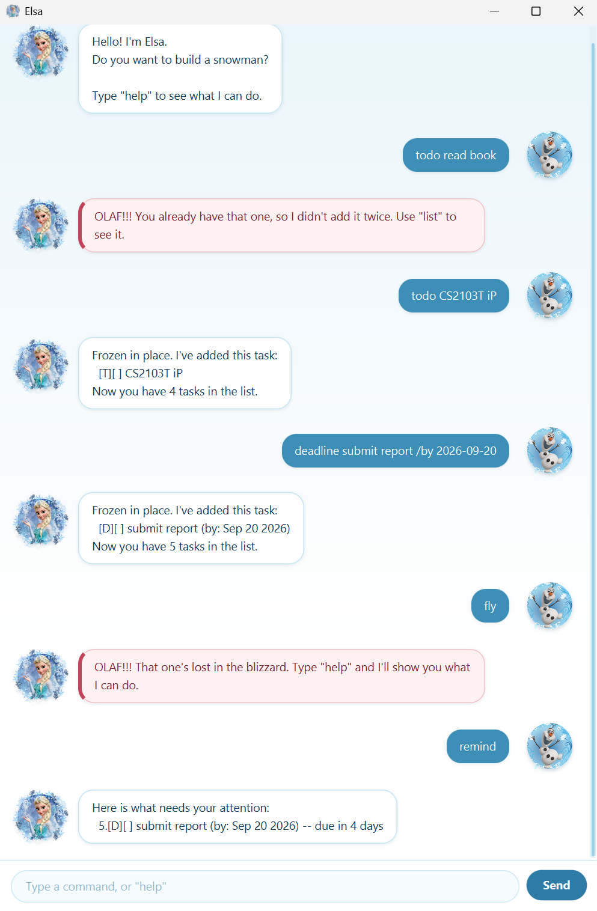

# Elsa User Guide

Elsa is a desktop chatbot for keeping track of the things you have to do. You
talk to her by typing, the way you would message a friend, and she answers in a
window.

She keeps three kinds of task — things with no date, things due by a date, and
things that run between two dates — and reminds you, without being asked, about
anything overdue or due within the week.



## Getting started

1. Make sure you have **Java 25** or later installed.
2. Download `elsa.jar` from the
   [latest release](https://github.com/yujiankoh/ip/releases).
3. Put it in a folder of its own. Elsa saves your tasks beside it, so a folder
   with nothing else in it is easiest to keep track of.
4. Open a command window in that folder and run:

   ```
   java -jar elsa.jar
   ```

Elsa greets you, tells you about anything needing attention, and waits. Type
`help` if you ever want the list of commands back.

## How to write a date

Four commands take a date. Any of these forms will do, and they all mean the
same day:

| Written as | Example |
|---|---|
| Year first | `2019-10-15` |
| Day first, with slashes | `15/10/2019` |
| Short month name | `Oct 15 2019` |
| Full month name | `October 15 2019` |

Month names are read whatever the capitalisation, so `oct 15 2019` is fine.

A date the calendar does not have is refused rather than quietly moved, so
`31/2/2019` is an error and not the 28th of February.

Elsa always *shows* dates the same way, as `Oct 15 2019`, however you typed
them.

## Features

### Adding a task with no date: `todo`

For something you have to do, with no particular day attached.

Format: `todo <description>`

Example: `todo read book`

```
Frozen in place. I've added this task:
  [T][ ] read book
Now you have 1 task in the list.
```

### Adding a deadline: `deadline`

For something due by a particular day.

Format: `deadline <description> /by <date>`

Example: `deadline return book /by 2027-01-20`

```
Frozen in place. I've added this task:
  [D][ ] return book (by: Jan 20 2027)
Now you have 2 tasks in the list.
```

A deadline that has passed and is not done yet carries ` -- overdue` wherever
it appears, so the same task would be shown as
`[D][ ] return book (by: Jan 20 2027) -- overdue` once that day is behind you.
Marking it done takes the note away.

### Adding an event: `event`

For something that runs from one day to another. A one-day event is written
with the same date twice.

Format: `event <description> /from <date> /to <date>`

Example: `event project meeting /from 2027-01-20 /to 2027-01-22`

```
Frozen in place. I've added this task:
  [E][ ] project meeting (from: Jan 20 2027 to: Jan 22 2027)
Now you have 3 tasks in the list.
```

An event cannot end before it starts, and Elsa says so rather than storing one
that runs backwards.

### Listing everything: `list`

Shows every task, numbered. Those numbers are what `mark`, `unmark` and
`delete` use.

Format: `list`

```
Here are the tasks in your list:
1.[T][ ] read book
2.[D][ ] return book (by: Jan 20 2027)
3.[E][ ] project meeting (from: Jan 20 2027 to: Jan 22 2027)
```

Each task is shown with two markers. The first is its kind — `[T]` todo, `[D]`
deadline, `[E]` event — and the second is whether it is done: `[X]` if it is,
`[ ]` if it is not.

If you have no tasks at all, Elsa answers `Into the Unknown.`

### Marking a task as done: `mark`

Format: `mark <task number>`

Example: `mark 1`

```
Let it go! I've marked this task as done:
  [T][X] read book
```

### Marking a task as not done: `unmark`

Format: `unmark <task number>`

Example: `unmark 1`

```
Back into the cold. I've marked this task as not done yet:
  [T][ ] read book
```

### Removing a task: `delete`

Format: `delete <task number>`

Example: `delete 1`

```
Melted away. I've removed this task:
  [T][ ] read book
Now you have 2 tasks in the list.
```

The tasks after it move up, so the numbers stay in one unbroken run. Check with
`list` before deleting again.

### Finding tasks: `find`

Shows the tasks whose description contains what you are looking for. Only the
description is searched, not the dates.

Format: `find <keyword>...`

Capitalisation is ignored, so `find BOOK` finds "read book".

Giving several keywords finds a task matching **any** of them, not only tasks
matching all.

Example: `find book`

```
Here are the matching tasks in your list:
1.[T][ ] read book
2.[D][ ] return book (by: Jan 20 2027)
```

Each task keeps the number it has in the full list, so you can use it with
`mark` or `delete` straight away.

If nothing matches, Elsa names what she looked for: `Nothing matching "socks".`

### Seeing one day: `on`

Shows the tasks falling on a date. A deadline falls on the day it is due; an
event falls on its first and last days and every day between them. Todos carry
no date, so they never appear here.

Format: `on <date>`

Example: `on 2027-01-20`

```
Here are the tasks on Jan 20 2027:
2.[D][ ] return book (by: Jan 20 2027)
3.[E][ ] project meeting (from: Jan 20 2027 to: Jan 22 2027)
```

If nothing falls on that day: `Nothing on Jan 20 2027.`

### Getting reminders: `remind`

Shows the deadlines that need your attention: every deadline that is **not
done** and is either **overdue** or **due within the next 7 days**. "Within the
next 7 days" counts today and the same weekday next week, so on a Monday a
deadline due next Monday is included.

Todos and events are never included, and neither is a deadline you have
already marked as done.

Format: `remind`

Anything typed after `remind` is ignored, so `remind 3` does the same as `remind`.

Deadlines are listed with the soonest first. Each keeps its number from the
full list, so you can use that number with `mark` or `delete` straight away.

Example: `remind` on Sep 13 2026

```
Here is what needs your attention:
  2.[D][ ] return book (by: Sep 10 2026) -- overdue
  5.[D][ ] email tutor (by: Sep 13 2026) -- due today
  8.[D][ ] buy gift (by: Sep 14 2026) -- due tomorrow
  4.[D][ ] submit report (by: Sep 20 2026) -- due in 7 days
```

If nothing needs your attention:

```
Nothing is overdue, and nothing is due in the next 7 days.
```

You are also reminded when Elsa starts, without typing anything. The same list
appears after the greeting, and after any warning about your saved file. If
nothing needs your attention, Elsa starts as usual and shows no reminder.

### Listing the commands: `help`

Shows how every command is written, grouped by what it is for, and how to write
a date.

Format: `help`

### Leaving: `bye`

Saves nothing extra — your tasks are already saved — and closes the window a
moment later, so you can read the farewell.

Format: `bye`

```
The cold never bother me anyways!
```

## When something goes wrong

Elsa answers a command she cannot carry out with a complaint beginning
`OLAF!!!`, shown in its own colour in the window so it is not mistaken for a
confirmation. The task list is left exactly as it was.

She says what to do about it, rather than only that something was wrong:

| If you | Elsa says |
|---|---|
| type a word that is not a command | `That one's lost in the blizzard. Type "help" and I'll show you what I can do.` |
| add a task you already have | `You already have that one, so I didn't add it twice. Use "list" to see it.` |
| give `/by`, `/from` or `/to` twice | `You gave "/by" more than once, and I don't know which one you meant.` |
| end an event before it starts | `An event cannot end before it starts, but you gave Oct 16 2019 to Oct 14 2019.` |
| use a task number that is not there | `There is no task 9. You have 3 tasks, so use a number from 1 to 3.` |
| use a task number with an empty list | `There are no tasks yet, so there is nothing to mark. Add one with "todo <description>" first.` |

## Saving your tasks

Elsa saves to `data/elsa.txt`, in a `data` folder beside the jar, and writes it
after **every** change. There is no save command, and nothing is lost by
closing the window.

The file is plain text, one task per line, with the fields separated by a bar:

```
T | 0 | read book
D | 1 | return book | 2027-01-20
E | 0 | project meeting | 2027-01-20 | 2027-01-22
```

The first field is the kind of task, and the second is `1` for done or `0` for
not done.

You can edit it by hand, but take a copy first. If Elsa cannot understand a
line she tells you which one, starts with the tasks she could read, and leaves
the rest out — and the next change you make rewrites the file **without** them.

## Command summary

| Command | Format |
|---|---|
| Add a todo | `todo <description>` |
| Add a deadline | `deadline <description> /by <date>` |
| Add an event | `event <description> /from <date> /to <date>` |
| List everything | `list` |
| Mark as done | `mark <task number>` |
| Mark as not done | `unmark <task number>` |
| Remove a task | `delete <task number>` |
| Find by keyword | `find <keyword>...` |
| See one day | `on <date>` |
| See what is due | `remind` |
| List the commands | `help` |
| Leave | `bye` |

## Acknowledgements

- Elsa's portrait is from [PNG Arts](https://www.pngarts.com/explore/218719).
- Olaf's portrait is from
  [PNG Mart](https://www.pngmart.com/files/6/Olaf-PNG-Photos.png).
- Elsa and Olaf are characters from Disney's *Frozen*. This is a student
  project, not affiliated with or endorsed by Disney.
- The Checkstyle rules in `config/checkstyle/` are from the
  [SE-EDU AddressBook Level 3](https://github.com/se-edu/addressbook-level3)
  project.
- The GitHub Actions workflow is based on the one in the
  [SE-EDU iP template](https://github.com/nus-cs2103-AY2627S1/ip).
- The dialog box is built with the `fx:root` pattern from the
  [SE-EDU JavaFX tutorial](https://se-education.org/guides/tutorials/javaFx.html).
- Claude Code (Anthropic) was used while building this project. The top-level
  [README](https://github.com/yujiankoh/ip/blob/master/README.md) says how.
